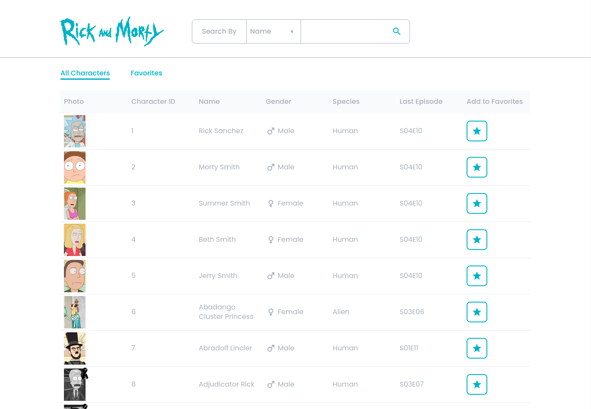
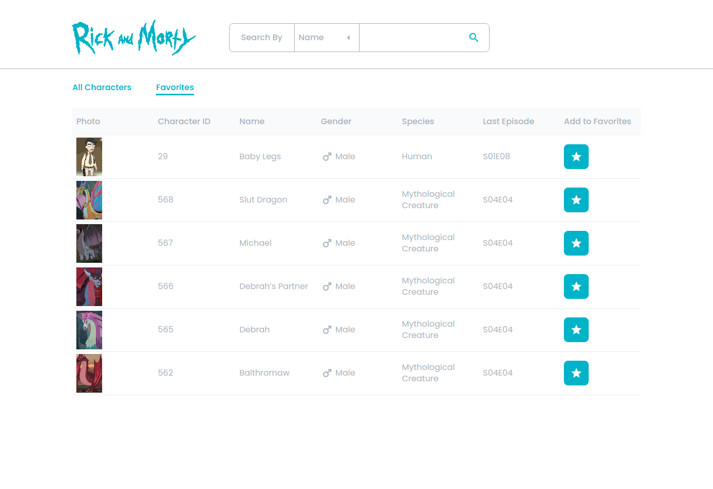

# rick-and-morty

## Screenshots

### Main page

### Favorites Page

## Features
- Browse characters of Rick & Morty
- Store favorite characters locally on client side
- Search by Name, Identifier or Episode

## Used technologies
- Vue 2
- Vuex
- TypeScript
- GraphQL
- Vue-apollo
- Sass

## Usage
### 1. Project setup -  `npm install`
### 2. Run the project - `npm run serve`
### 3. Open the project - http://localhost:8080/

## Online version

It is also available on [Netlify](https://mr-rick-and-morty.netlify.app/)
